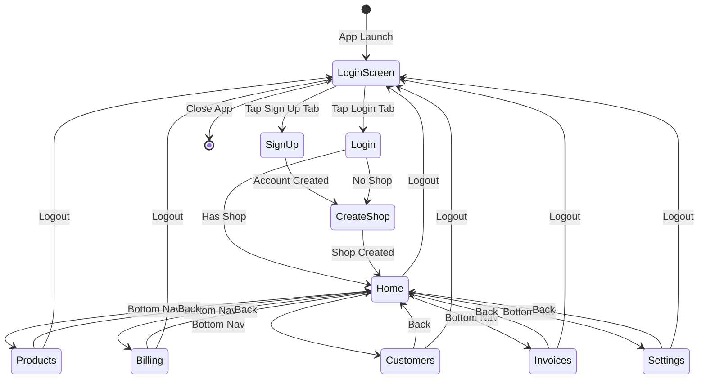

# ShopOS Mobile - Complete User Flow

## 🎯 User Journey Map

```
┌─────────────────────────────────────────────────────────────┐
│                    SHOPOS USER FLOW                          │
└─────────────────────────────────────────────────────────────┘

NEW USER:
  App Launch → Login Screen → Sign Up → Create Shop → Home → Use App
  
RETURNING USER:
  App Launch → Login Screen → Login → Home → Use App
  
LOGOUT:
  Any Screen → Account Menu/Settings → Logout → Login Screen
```

---

## 📱 Detailed Flow with Screenshots

### FLOW 1: New User Signup & Shop Creation

#### Step 1: App Launch
```
┌──────────────────────────────┐
│         ShopOS Logo          │
│                              │
│   [Login]  |  [Sign Up]      │  ← Toggle tabs
│                              │
│   Email: _______________     │
│   Password: ___________      │
│                              │
│   [Login/Sign Up Button]     │
│                              │
│   Terms & Privacy Policy     │
└──────────────────────────────┘
```
**User Action**: Clicks "Sign Up" tab

#### Step 2: Sign Up Form
```
┌──────────────────────────────┐
│         ShopOS Logo          │
│                              │
│   [Login]  |  [Sign Up] ✓    │  ← Sign Up selected
│                              │
│   Email: test@example.com    │
│   Password: ••••••••         │ ← Show/hide toggle
│                              │
│   [Sign Up Button]           │
│                              │
└──────────────────────────────┘
```
**Requirements**:
- Valid email format
- Password: minimum 6 characters
- Email confirmation: DISABLED (set in Supabase)

**User Action**: Enters email & password, clicks "Sign Up"

#### Step 3: Account Created
```
┌──────────────────────────────┐
│  ✅ Account created!         │  ← Success message
│                              │
│  Redirecting to shop         │
│  creation...                 │
└──────────────────────────────┘
```
**Backend**: 
- User created in auth.users
- Auto-logged in
- Session created

**Auto-redirect**: → Create Shop Screen (2 seconds)

#### Step 4: Create Shop Screen
```
┌──────────────────────────────┐
│  ← Back   Create Your Shop   │
│                              │
│  Step 1 of 1                 │
│                              │
│  Shop Name: *                │
│  └─ My Kirana Store          │
│                              │
│  Phone: *                    │
│  └─ 9876543210              │
│                              │
│  Address:                    │
│  └─ 123 Main Street,        │
│     Mumbai 400001           │
│                              │
│  GSTIN (optional):           │
│  └─ 27AABCU9603R1ZV         │
│                              │
│  Select Shop Type: *         │
│  ┌──────┬──────┬──────┐     │
│  │ 🏪   │ 💊   │ ✂️    │     │
│  │Kirana│Pharma│Salon │     │
│  └──────┴──────┴──────┘     │
│                              │
│  [Create Shop Button]        │
└──────────────────────────────┘
```
**Required Fields**: Shop Name, Phone, Shop Type
**Optional**: Address, GSTIN

**User Action**: Fills form, clicks "Create Shop"

#### Step 5: Shop Creation Process
```
Backend Actions (Sequential):
1. Create/Update profile
   INSERT INTO profiles (id, phone, name)
   
2. Create tenant (shop)
   INSERT INTO tenants (name, shop_type, phone, address, gstin)
   Returns: tenant_id
   
3. Create membership (link user to shop)
   INSERT INTO memberships (tenant_id, user_id, role='owner')
```

#### Step 6: Shop Created Success
```
┌──────────────────────────────┐
│  ✅ Shop created             │
│     successfully!            │
│                              │
│  Loading dashboard...        │
└──────────────────────────────┘
```
**Auto-redirect**: → Home Screen (Dashboard)

#### Step 7: Home Screen (Dashboard)
```
┌──────────────────────────────┐
│ ShopOS        👤 [Account▼]  │  ← Logout menu
├──────────────────────────────┤
│                              │
│  Today's Sales               │
│  ┌───────────────────────┐  │
│  │ ₹12,450  23  ₹7,200  │  │
│  │  Total  Bills  Cash   │  │
│  └───────────────────────┘  │
│                              │
│  Quick Actions               │
│  ┌──────┬──────┬──────┐     │
│  │📄New │📦Add │📊Rep-│     │
│  │Bill  │Prod  │orts  │     │
│  └──────┴──────┴──────┘     │
│                              │
├──────────────────────────────┤
│ 🏠 | 📦 | 💰 | 👥 | 📄 | ⚙️│  ← Bottom nav
└──────────────────────────────┘
```
**User can now**: Use all app features!

---

### FLOW 2: Returning User Login

#### Step 1: App Launch
```
┌──────────────────────────────┐
│         ShopOS Logo          │
│                              │
│   [Login] ✓ |  [Sign Up]     │  ← Login pre-selected
│                              │
│   Email: _______________     │
│   Password: ___________      │
│                              │
│   [Login Button]             │
└──────────────────────────────┘
```

#### Step 2: Login Process
```
Backend Check:
1. Verify credentials
   auth.signInWithPassword(email, password)
   
2. Check if user has shop
   SELECT tenant_id FROM memberships 
   WHERE user_id = <current_user>
   
3. Route user:
   - Has shop → Home Screen
   - No shop → Create Shop Screen
```

#### Step 3: Success
```
If shop exists:
  → Home Screen (Dashboard)

If no shop:
  → Create Shop Screen
```

---

### FLOW 3: Logout Flow

#### Option A: Quick Logout (From Any Screen)

**Step 1**: Tap account icon (top-right)
```
┌──────────────────────────────┐
│ ShopOS    👤 [Account▼] ←──┐ │
├────────────┬─────────────────┤
│            │ user@email.com  │
│            │ Logged in       │
│            ├─────────────────┤
│            │ 🚪 Logout       │ ← Tap here
│            └─────────────────┘
```

**Step 2**: Confirm logout
```
┌──────────────────────────────┐
│          Logout              │
│                              │
│  Are you sure you want to    │
│  logout?                     │
│                              │
│  [Cancel]  [Logout]          │ ← Tap Logout
└──────────────────────────────┘
```

**Step 3**: Logged out
```
→ Login Screen
Session cleared ✅
```

#### Option B: Settings Logout

**Step 1**: Navigate to Settings
```
┌──────────────────────────────┐
│ 🏠 | 📦 | 💰 | 👥 | 📄 | ⚙️│
└────────────────────────────┬─┘
                             ↑
                    Tap Settings
```

**Step 2**: Scroll to bottom
```
┌──────────────────────────────┐
│  Privacy Policy              │
├──────────────────────────────┤
│                              │
│  [🚪 Logout - RED]          │ ← Tap here
│                              │
└──────────────────────────────┘
```

**Step 3**: Confirm and logout
```
Same confirmation → Login Screen
```

---

## 🔄 Complete State Transitions



---

## 📊 Database State Changes

### New User Signup + Create Shop:
```sql
-- Step 1: Signup (Automatic)
INSERT INTO auth.users (email, encrypted_password, ...)
VALUES ('user@example.com', ..., ...);

-- Step 2: Create Profile (App does this)
INSERT INTO public.profiles (id, phone, name)
VALUES (auth.uid(), '9876543210', 'User Name');

-- Step 3: Create Tenant (App does this)
INSERT INTO public.tenants (name, shop_type, phone, address)
VALUES ('My Shop', 'retail', '9876543210', '123 Main St')
RETURNING id;  -- Returns tenant_id

-- Step 4: Create Membership (App does this)
INSERT INTO public.memberships (tenant_id, user_id, role)
VALUES (tenant_id, auth.uid(), 'owner');
```

### Login:
```sql
-- Check membership
SELECT tenant_id 
FROM public.memberships 
WHERE user_id = auth.uid() 
AND is_active = true;

-- If result exists → Has shop → Home
-- If no result → No shop → Create Shop
```

### Logout:
```sql
-- Clear session (handled by Supabase)
auth.signOut();
```

---

## ✅ User Flow Checklist

### First-Time User:
- [ ] App launches to Login screen
- [ ] Switches to Sign Up tab
- [ ] Enters email + password
- [ ] Clicks Sign Up
- [ ] Sees success message
- [ ] Redirected to Create Shop screen
- [ ] Fills shop details
- [ ] Clicks Create Shop
- [ ] Shop created successfully
- [ ] Redirected to Home screen
- [ ] Can navigate all tabs
- [ ] Can logout from account menu

### Returning User:
- [ ] App launches to Login screen
- [ ] Login tab already selected
- [ ] Enters credentials
- [ ] Clicks Login
- [ ] Redirected to Home screen (has shop)
- [ ] Can use all features
- [ ] Can logout anytime

### Edge Cases Handled:
- [ ] Invalid email format → Error shown
- [ ] Weak password → Error shown
- [ ] Existing email → Error shown
- [ ] Network error → Error shown
- [ ] Session expired → Redirect to login
- [ ] Incomplete shop form → Validation error
- [ ] Database error → Error message

---

## 🎯 Success Criteria

A proper user flow is confirmed when:

1. ✅ **New User**:
   - Sign up → Create shop → Home screen
   - No manual steps needed
   - Clear feedback at each step

2. ✅ **Existing User**:
   - Login → Home screen
   - Previous data loads
   - Can continue working

3. ✅ **Logout**:
   - From any screen
   - Confirmation dialog
   - Clean session clear
   - Return to login

4. ✅ **Error Handling**:
   - Clear error messages
   - No crashes
   - User can recover

---

## 📱 Navigation Summary

```
Bottom Navigation (Always visible on Home):
├─ 🏠 Home (Dashboard)
├─ 📦 Products (Product Management)
├─ 💰 Billing (POS/Create Invoice)
├─ 👥 Customers (Customer List)
├─ 📄 Invoices (Invoice History)
└─ ⚙️ Settings (Shop/User Settings)

Top Right (All screens):
└─ 👤 Account Menu
   ├─ User Email
   └─ 🚪 Logout

Settings Screen:
├─ Shop Profile
├─ User Profile
├─ Language
├─ About
└─ 🚪 Logout Button (Red)
```

---

This is the complete, correct user flow! Every step is defined, every error is handled, and every path leads somewhere meaningful. 🚀
